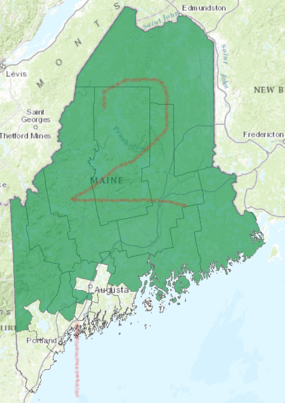

# The Christian Influence

With the elections and the nearness of Thanksgiving and Christmas, it is helpful to be reminded of the importance of a Christian influence in every arena of life. You can carry this pamphlet with any notes you add to it with you as a reminder.

## Scriptures on Influence

> **Matthew 5:13-16**&mdash;Ye are the salt of the earth: but if the salt have lost his savour, wherewith shall it be salted? it is thenceforth good for nothing, but to be cast out, and to be trodden under foot of men. 14  Ye are the light of the world. A city that is set on an hill cannot be hid. 15  Neither do men light a candle, and put it under a bushel, but on a candlestick; and it giveth light unto all that are in the house. 16  Let your light so shine before men, that they may see your good works, and glorify your Father which is in heaven. 
<!-- -->
> **Proverbs 1:8-9**&mdash; 8 My son, hear the instruction of thy father, and forsake not the law of thy mother: 9 For they shall be an ornament of grace unto thy head, and chains about thy neck.
<!-- -->
> **Proverbs 7:1-5**&mdash; 1 My son, keep my words, and lay up my commandments with thee. 2 Keep my commandments, and live; and my law as the apple of thine eye. 3 Bind them upon thy fingers, write them upon the table of thine heart. 4 Say unto wisdom, Thou art my sister; and call understanding thy kinswoman: 5 That they may keep thee from the strange woman, from the stranger which flattereth with her words.
<!-- -->
> **Proverbs 25:15**&mdash;By long forbearing is a prince persuaded, and a soft tongue breaketh the bone.
<!-- -->
> **Philippians 4:8-9**&mdash; 8 Finally, brethren, whatsoever things are true, whatsoever things are honest, whatsoever things are just, whatsoever things are pure, whatsoever things are lovely, whatsoever things are of good report; if there be any virtue, and if there be any praise, think on these things. 9 Those things, which ye have both learned, and received, and heard, and seen in me, do: and the God of peace shall be with you.
<!-- -->
> **Romans 12:1-2**&mdash; 1 I beseech you therefore, brethren, by the mercies of God, that ye present your bodies a living sacrifice, holy, acceptable unto God, which is your reasonable service. 2 And be not conformed to this world: but be ye transformed by the renewing of your mind, that ye may prove what is that good, and acceptable, and perfect, will of God.
<!-- -->
> **1 Corinthians 5:6-8**&mdash; 6 Your glorying is not good. Know ye not that a little leaven leaveneth the whole lump? 7 Purge out therefore the old leaven, that ye may be a new lump, as ye are unleavened. For even Christ our passover is sacrificed for us: 8 Therefore let us keep the feast, not with old leaven, neither with the leaven of malice and wickedness; but with the unleavened bread of sincerity and truth.
<!-- -->
> **2 Corinthians 6:14-18**&mdash; 14 Be ye not unequally yoked together with unbelievers: for what fellowship hath righteousness with unrighteousness? and what communion hath light with darkness? 15 And what concord hath Christ with Belial? or what part hath he that believeth with an infidel? 16 And what agreement hath the temple of God with idols? for ye are the temple of the living God; as God hath said, I will dwell in them, and walk in them; and I will be their God, and they shall be my people. 17 Wherefore come out from among them, and be ye separate, saith the Lord, and touch not the unclean thing; and I will receive you, 18 And will be a Father unto you, and ye shall be my sons and daughters, saith the Lord Almighty. 
<!-- -->
> **1 Corinthians 15:33**&mdash;Be not deceived: evil communications corrupt good manners.

## Examples of Christian Influence

### 1. Joseph in Egypt

> **Genesis 41:41-43**&mdash;And Pharaoh said unto Joseph, See, I have set thee over all the land of Egypt. 42 And Pharaoh took off his ring from his hand, and put it upon Joseph’s hand, and arrayed him in vestures of fine linen, and put a gold chain about his neck; 43 And he made him to ride in the second chariot which he had; and they cried before him, Bow the knee: and he made him ruler over all the land of Egypt.

### 2. Asa

> **1 Kings 15:11-14**&mdash; And Asa did that which was right in the eyes of the Lord, as did David his father. 12 And he took away the sodomites out of the land, and removed all the idols that his fathers had made. 13 And also Maachah his mother, even her he removed from being queen, because she had made an idol in a grove; and Asa destroyed her idol, and burnt it by the brook Kidron. 14 But the high places were not removed: nevertheless Asa’s heart was perfect with the Lord all his days.

### 3. Maewyn Succat of Scotland

>  	Maewyn was a Christian missionary credited with converting Ireland to Christianity in the AD 400s. He was not actually Irish but Scottish. Maewyn took on the name Patrick upon becoming a Christian. As a teen he was kidnapped by pirates and sold into slavery in Ireland to herd and tend sheep. During his six-year captivity, he became fluent in the Irish language, he turned to God in prayer. He escaped after having a dream sent from God in which he was told to leave Ireland by going to the coast where he would find a ship waiting to sail to Britain. Patrick was sent another dream in which the people of Ireland were calling out to him to come and walk among them once more. He was set the task of teaching Christianity to the Irish. He travelled throughout Ireland, preaching the Gospel and converting many. He and his disciples preached and converted thousands and began building churches all over the country.

### 4. Peter Cartwright

> The Battle of New Orleans had made Andrew Jackson a national hero overnight. Andrew Jackson was better known for his attendance at duels than at church, but on a particular Monday in October of 1818, he decided to visit a revival service in Nashville where the controversial Peter Cartwright was scheduled to speak. As it happened, the General entered as the preacher was reading his text, "For what shall it profit a man, if he shall gain the whole world, and lose his own soul?" (Mark 8:36) With all the seats already occupied, the famous Indian fighter and war hero was content to stand, gracefully leaning on the middle post. At the sight of his stately appearance, the host pastor, a certain "Brother Mac," became nervous in the extreme. Seated on the platform directly behind the pulpit, he tugged on Cartwright's jacket, whispering, "General Jackson has come in; General Jackson has come in." Cartwright was aghast at the pastor's double standard: I felt a flash of indignation run all over me like an electric shock, and facing about to my congregation, and purposely speaking out audibly, I said, "Who is General Jackson? If he don't get his soul converted, God will damn him as quick as he would a any slave." -- -- --  "Mr. Cartwright, you are a man after my own heart. I am very surprised at Mr. Mac, to think that I would be offended at you. No, sir; I told him that I highly approved of your independence; that a minister of Jesus Christ ought to love every body and fear no mortal man. I told Mr. Mac that if I had a few thousand such independent, fearless officers as you were, and a well drilled army, I could take Old England."

## Referendums

<!-- -->
> **1 Kings 10:1-2**&mdash;

Tuesday, November 8 - polls open at 7 am or 8 am and all close 8 pm. As well as voting for a new president, Mainers will vote on five referendum questions placed on the state ballot through citizen petition drives, the most ever in a Maine election. 

### 1. Question 1 – legalize recreational use of marijuana

“Do you want to allow the possession and use of marijuana under state law by persons who are at least 21 years of age, and allow the cultivation, manufacture, distribution, testing, and sale of marijuana and marijuana products subject to state regulation, taxation and local ordinance?”

YES or NO

### 2. Question 2 – education surcharge

“Do you want to add a 3 percent tax on individual Maine taxable income above $200,000 to create a state fund that would provide direct support for student learning in kindergarten through 12th grade public education?”

YES or NO

### 3. Question 3 – require background checks for private gun purchases

“Do you want to require background checks prior to the sale or transfer of firearms between individuals not licensed as firearms dealers, with failure to do so punishable by law, and with some exceptions for family members, hunting, self-defense, lawful competitions, and shooting range activity?”

YES or NO

### 4. Question 4 – minimum wage

“Do you want to raise the minimum hourly wage of $7.50 to $9 in 2017, with annual $1 increases up to $12 in 2020, and annual cost-of-living increases thereafter; and do you want to raise the direct wage for service workers who receive tips from half the minimum wage to $5 in 2017, with annual $1 increases until it reaches the adjusted minimum wage?”

YES or NO

### 5. Question 5 – ranked-choice voting

“Do you want to allow voters to rank their choices of candidates in elections for U.S. Senate, Congress, Governor, State Senate, and State Representative, and to have ballots counted at the state level in multiple rounds in which last-place candidates are eliminated until a candidate wins by majority?”

YES or NO

## Presidential Election

In 2016, Maine has four electoral votes, which is 1.5 percent of the 270 electoral votes needed to win the general election. 

Maine is divided into 2 Congressional districts each will award 2 electoral votes to the candidate with the most votes. 
- FIRST: Cumberland County, Parts of Kennebec County, Knox County, Lincoln County, Sagadahoc County, York County
- SECOND: Androscoggin County, Aroostook County, Franklin County, Hancock County, Parts of Kennebec County, Oxford County, Penobscot County, Piscataquis County, Somerset County, Waldo County, Washington County

### The Choices:

#### Democratic Party - Hillary Clinton
#### Republican Party - Donald Trump
#### Libertarian Party - Gary Johnson
#### Green Party - Dr. Jill Stein
#### Constitution Party - Darrell Castle
#### **Plus many others not listed in all states

### The Issues:

"But I am part of such a small minority!" When it comes to judgment before God, the question is not what did others do, but what did I do?

After careful and prayer consideration which candidate will best ...

#### Spiritual Direction

Influence a greater awareness of God and America's dependance upon God's blessing. Will act and make decisions that encourage or at least allow Christians to evangelize and influence our nation.

> 2 Chronicles 7:14&mdash;If my people, which are called by my name, shall humble themselves, and pray, and seek my face, and turn from their wicked ways; then will I hear from heaven, and will forgive their sin, and will heal their land.

#### Economy

Will be a part of creating an atmosphere of opportunity instead of slavery in our nation.

> Luke 10:7&mdash;And in the same house remain, eating and drinking such things as they give: for the labourer is worthy of his hire. Go not from house to house.

#### Abortion

Defend the unborn and promote others who will fight for the lives of the unborn.

>  Proverbs 6:16-17&mdash;These six things doth the Lord hate: yea, seven are an abomination unto him:   17 A proud look, a lying tongue, and hands that shed innocent blood,

#### Homosexual/Transgender Agenda

Will resist and push back on the tide and fashion of perversion.

> Romans 1:26-7&mdash; 26 For this cause God gave them up unto vile affections: for even their women did change the natural use into that which is against nature: 27 And likewise also the men, leaving the natural use of the woman, burned in their lust one toward another; men with men working that which is unseemly, and receiving in themselves that recompence of their error which was meet.

#### Safety, National Security

Fear of God, loyalty to Israel and Sincere Priority of America's safety.

> Psalms 122:6&mdash;Pray for the peace of Jerusalem: they shall prosper that love thee.

