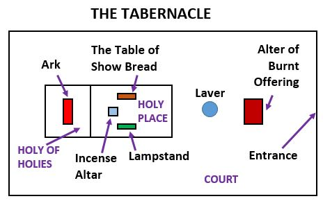

# Lesson #3 Mercy Seat, Exodus 25:17-22

## I. Holiest of Holies

The Ark of the Covenant and the Mercy Seat are the only furniture in the Holiest of Holies.

> Le 16:1 ¶ And the LORD spake unto Moses after the death of the two sons of Aaron, when they offered before the LORD, and died; 2 And the LORD said unto Moses, Speak unto Aaron thy brother, that he come not at all times into the holy place within the vail before the mercy seat, which is upon the ark; that he die not: for I will appear in the cloud upon the mercy seat.

Only once a year on the Day of Atonement (Yom Kuppur) could the High Priest enter beyond the veil into the Holiest of Holies where the Ark was kept. The Holiest of Holies was a 10 cubit square room which housed the most important furniture of the Tabernacle &mdash; the ark of the covenant.

The Holy of Holies is a Type for God's Throne room in Heaven.

> Hebrews 9:22-24 &mdash; Heb 9:22 And almost all things are by the law purged with blood; and without shedding of blood is no remission. 23 ¶ It was therefore necessary that the patterns of things in the heavens should be purified with these; but the heavenly things themselves with better sacrifices than these. 24 For Christ is not entered into the holy places made with hands, which are the figures of the true; but into heaven itself, now to appear in the presence of God for us:

## II. The Presence of God Rested Between the Cherubim

The Mercy Seat and Cherubim were of one piece solid gold. It was of pure gold that weighed around 566 pounds (@$1320 oz. = $11,953,920).

The first mention of "Cherubmin" is in Geneis 3:24 where their ministry was the gaurd the approach to the tree of life. Guarding the sacred.

> Ex 25:18-20 &mdash; And thou shalt make two cherubims of gold, of beaten work shalt thou make them, in the two ends of the mercy seat. 19 And make one cherub on the one end, and the other cherub on the other end: even of the mercy seat shall ye make the cherubims on the two ends thereof. 20 And the cherubims shall stretch forth their wings on high, covering the mercy seat with their wings, and their faces shall look one to another; toward the mercy seat shall the faces of the cherubims be.

<!-- -->

> Psalm 99:1 ¶ The LORD reigneth; let the people tremble: he sitteth between the cherubims; let the earth be moved.

<!-- -->

> Psalm 80:1 &mdash; Give ear, O Shepherd of Israel, thou that leadest Joseph like a flock; thou that dwellest between the cherubims, shine forth.

## III. A Covering

The Mercy Seat formed the lid of the Ark of the Covenant.  It functioned as a "covering" for the Ark of the Covenant", and signifies God's "covering" for sin. It is the place where God has shown mercy.

> Romans 3:25 &mdash; Whom God hath set forth to be a propitiation through faith in his blood, to declare his righteousness for the remission of sins that are past, through the forbearance of God; [propitiation = mercy seat]

In the Ark, we find the "Testimony" of God which Christ perfectly fulfilled in life (Hebrews 4:15) and in the mercy seat we see Christ in His death was made a propitiation for us. God's mercy could only rest on a "pedastal" of perfect righteousness.

> Romans 5:21 That as sin hath reigned unto death, even so might grace reign through righteousness unto eternal life by Jesus Christ our Lord.

Men Dared not approach the Ark, but God could approach the Brazen Altar. It was blood from the Brazen altar that was sprinkled on the Mercy Seat. Here the Cross and the Throne meet; Here Mercy and Truth are Come Together. God came all the way from the Throne to the Cross, that he might receive to the Throne a "REDEEMED PEOPLE".

## IV. The Blood Sprinkling

Leviticus 16:14
Once on the mercy seat (satisfaction to God)
Seven times on the Earth (satisfaction to man)

##. V. The Overspread Wings (Mercy and Truth)

- With great fear the High Priest entered the Holiest of Holies just once a year. Entered with fear ... We can enter without fear

>  Hebrews 4:16 Let us therefore come boldly unto the throne of grace, that we may obtain mercy, and find grace to help in time of need.

<!-- -->

>  Psalm 25:10 &mdash;  All the paths of the LORD are mercy and truth unto such as keep his covenant and his testimonies.
<!-- -->
>  Ps 85:10 &mdash; Mercy and truth are met together; righteousness and peace have kissed each other.
<!-- -->

- Over spread wings ... Boaz to Ruth
- Jesus to Jerusalem Jerusalem how long I would have gathered you
- God talks to us from the place of Mercy and truth

