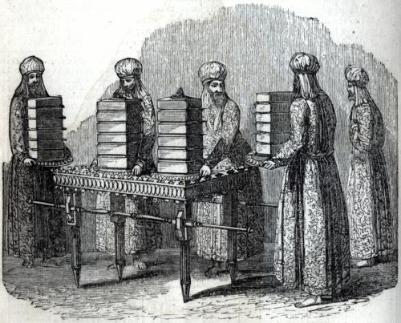

# Lesson #4 Table of Shewbread (Fellowship), Exodus 25:23-30

## Introduction

- READ: Exodus 25:23-30; Exodus 37:10-16; 40:22; Lev. 24:5-9; Numbers 4:7-8
- The Hebrew expression translated “shewbread” is literally, “bread of face,” or “bread of presence”—bread, that is, which was set forth always before the presence of God.
- The Table and the Bread were considered as one. 

## The Materials of the Table of Shewbread

- The incorruptible shittim or accacia wood -- Christ's humanity. 
- Gold -- Christ's Divinity. 

Here again we see the perfect blending of the human and divine nature of Christ.

## The Measurements

- 42 inches long X 21 inches broad X 28 inches high.
- It had around the edge a golden crown, also a band or border of gold. All the dishes used in connection with the table were of pure gold.

## The Bread

For seven days twelve loaves of fine flour with frankincense were presented before the Lord upon the Table of Shewbread after which time they were replaced by others and then became the food of priests who fed upon them in the Holy Place.

12 is the number of Governmental or Administrative perfection: 

- There were 12 tribes of Israel.
- There were 12 stones in the High Priest's breastplate.
- Joshua placed 12 stones in the bed of the Jordan River.
- Elijah built an altar of 12 stones.
- Solomon's molten sea stood on twelve brass oxen.
- Jesus chose 12 Disciples.
- In Revelation, we read of the woman with a crown of twelve stars.
- Also in Revelation, we read that the New Jerusalem has 12 gates at the gates 12 angels and that it has 12 foundations and in those foundations the names of the 12 apostles and the Lamb.
- Also in Revelation, we read of a tree that bears 12 manner of fruits.
- Also in Revelation, we read that the 12 Apostles will sit on 12 thrones judging the 12 tribes of Israel.

7 is the number of perfection and the 7 days that the 12 loaves of bread were presented before the Lord sets forth the perfection of the Divine enjoyment of Christ.

## Fulfillments or Antitypes

### The 12 Tribes of Israel

The 12 loaves no doubt include in their meaning the 12 tribes of Israel who were also represented in the 12 stones on the High Priest's breastplate. Those stones were a continual memorial unto the Lord of the 12 tribes and His covenant promises unto them.

> Exodus 28:29 &mdash; And Aaron shall bear the names of the children of Israel in the breastplate of judgment upon his heart, when he goeth in unto the holy place, for a memorial before the LORD continually.

### Christ

The table stood toward the north wall of the Holy Place. The table and the 12 loaves shadow forth Christ as presented before God unceasingly in all the Excellency of His humanity and administered as food to the priestly family.

> John 6:31-58 &mdash; v. 35 And Jesus said unto them, I am the bread of life: he that cometh to me shall never hunger; and he that believeth on me shall never thirst.
<!-- -->
> 1 Peter 2:9 &mdash; 1Pe 2:9 But ye are a chosen generation, a royal priesthood, an holy nation, a peculiar people; that ye should shew forth the praises of him who hath called you out of darkness into his marvellous light:
<!-- -->
> Revelation 1:6 &mdash; And hath made us kings and priests unto God and his Father; to him be glory and dominion for ever and ever. Amen.

The frankincense points out the entire devotion and fragrance of Christ's life Godward.

> Song of Solomon 3:6 &mdash; Who is this that cometh out of the wilderness like pillars of smoke, perfumed with myrrh and frankincense, with all powders of the merchant?
<!-- -->
> Song of Solomon 4:6 &mdash; Until the day break, and the shadows flee away, I will get me to the mountain of myrrh, and to the hill of frankincense. 

The bread of the tabernacle was made of **fine flour** and was **unleavened** (leaven is a type of hypocrisy and mixture of evil) setting forth the perfection of Christ. There was no unevenness (fine flour) in Christ and neither is there any leaven of doctrine or morality in Him (unleavened).

The corn was to be crushed, bruised and baked (the fire of Divine judgment) before it became food for the priests. In many of the details of the Tabernacle and its service we have the sufferings of Jesus Christ typified by the crushing and beating of different substances. 

- Both the Candlestick and the Mercy Seat were made of beaten gold.
- The spices for the holy ointment, for the incense and the frankincense were crushed, for they would not otherwise give forth their fragrances. 
- The perfume was made through the beating of its ingredients into very small fragments. (Exodus 30:36)
- The oil with which the ointment was compounded and the oil for the meal offering was beaten oil and for the candle **pure** oil, olive beaten for light. (Exodus 27:20)
- The corn for the meal offering was beaten out of full ears. In Christ, every characteristic is evenly balanced. The Captain of our Salvation was made **perfect through sufferings** (Hebrews 2:10).

All these different pictures speak to us of the sufferings or our Lord throughout His lifetime. Gethsemane means **olive press** and it was not only on that last awful night that Christ visited it but &quot; of time resorted thither with His disciples. &quot; His whole life was one of suffering yet &quot; it please the Lord to bruise Him&quot. Why?  Because it was through the process of suffering that He was made bread. He was the &quot; corn of wheat &quot; that must fall into the ground and die that the world might be fed with the increase. (John 12:24)

In the Last Supper, Jesus broke the bread and said, &quot;This is my body which is broken for you.&quot; He calls Himself the true bread and the living bread which if a man eat, he will live forever. The bread which He gave was His flesh. Priests only could feed upon the Shewbread. Believers now are unto God a Kingdom of Priests and as such they are invited to draw near.

> Isaiah 55:2 &mdash; &hellip; eat ye that which is good, and let your soul delight itself in fatness.
<!-- -->
> John 6:34 &mdash; &hellip; Lord, evermore give us this bread

Richard Blanchard (1925-2004) wrote these words in 1964 to the song "Fill My Cup, Lord":

**CHORUS**
Fill my cup, Lord; I lift it up Lord;
Come and quench this thirsting of my soul.
Bread of Heaven, feed me till I want no more.
Fill my cup, fill it up and make me whole.

**VERSE 1**

Like the woman at the well, I was seeking
For things that could not satisfy.
And then I heard my Savior speaking—
“Draw from My well that never shall run dry.”

**VERSE 2**

There are millions in this world who are seeking
For pleasures earthly goods afford.
But none can match the wondrous treasure
That I find in Jesus Christ my Lord.

**VERSE 3**

So my brother if the things that this world gives you
Leave hungers that won’t pass away,
My blessed Lord will come and save you
If you kneel to Him and humbly pray—

### The Church

Not only do we see in the fine flour a type of Jesus Christ, but we see the church identified with Him in the bread. 

> 1 Corinthians 10: 17 &mdash; For we being many are one bread, and one body: for we are all partakers of that one bread.

Are we willing to fellowship the offerings of our blessed Lord that we might be bread to feed the hungry?

>  Matthew 14:16 &mdash; But Jesus said unto them, They need not depart; **give ye them to eat**.

## Questions

1. Give the Literal Meaning of the word "shewbread"?

2. What two natures do we see of Christ in the materials of the shewbread?

3. Describe the table of shewbread?
	1. DIMENSIONS
	2. CROWN
	3. BORDER
	4. DISHES

5. How are the 12 Tribes foreshadowed?
6. How is Christ foreshadowed? (the process and ingredients) 
7. How is the Church foreshadowed?
 