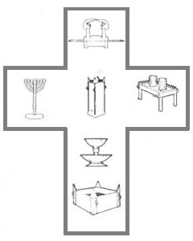

# Lesson #9 Ordering of the Furniture of the Tabernacle, Exodus 26:34-35

## Introduction

<!-- add from the printed notes thoughts on the WISDOM of the tabernacle -->

> Exodus 26:34-35 &mdash; And thou shalt put the mercy seat upon the ark of the testimony in the most holy place. 35 And thou shalt set the table without the vail, and the candlestick over against the table on the side of the tabernacle toward the south: and thou shalt put the table on the north side.
 

(Note: The Altar of Incense is not mentioned in this particular Biblical text, but you can find it on the graphic located in the Holy Place. We will consider this in more detail once we study the Altar of Incense in particular.)

> Hebrews 10:1 &mdash; For the law having a shadow of good things to come, and not the very image of the things, can never with those sacrifices which they offered year by year continually make the comers thereunto perfect.

The law was a shadow of good things to come. We can see the outline of a cross in the furniture arrangement!

Starting at the foot of the "cross":

## 1. Brazen Altar

The Brazen Altar was brass (typical of judgment) covered with gold (typical of the Divine nature). We see in its service the message of **JUSTIFICATION**. Upon it was poured out the blood of sacrifices. Its four horns represent the power of the blood of Jesus Christ.

> Romans 1:16-18 &mdash; Romans 1:6 ¶ For I am not ashamed of the gospel of Christ: for it is the power of God unto salvation to every one that believeth; to the Jew first, and also to the Greek. 17 For therein is the righteousness of God revealed from faith to faith: as it is written, The just shall live by faith. 18 For the wrath of God is revealed from heaven against all ungodliness and unrighteousness of men, who hold the truth in unrighteousness;

## 2. Laver

The Laver was a large bowl filled with water and was also made of brass covered with gold. Its service speaks to us the message of **SANCTIFICATION**. There is power in the Word of God.

> John 17:17 &mdash; Sanctify them through thy truth: thy word is truth.

## 3. Golden Candlestick

The Golden Candlestick was made of pure gold and its service speaks to us of the **UNION** of the Church which is His Body with Christ. He is IN US and we are IN Him! He has but ONE Church. The Church's power is in Him and Abiding in Him.

> Revelation 1:4,13 &mdash; John to the seven churches which are in Asia: Grace be unto you, and peace, from him which is, and which was, and which is to come; and from the seven Spirits which are before his throne; 13 And in the midst of the seven candlesticks one like unto the Son of man, clothed with a garment down to the foot, and girt about the paps with a golden girdle.

## 4. Golden Altar of Incense

The Golden Altar of Incense was made of Acacia wood overlaid with pure gold and its service speaks to us of **INTERCESSION**. The Altar of Incense had four horns as well as the Brazen Altar did. There is power in prayer which is not disconnected from the power in the Blood we saw in the Brazen Altar.

> 1 Thessalonians 5:17 &mdash; Pray without ceasing.

## 5. Table of Shewbread

The Table of Shewbread was made of acacia wood overlaid with gold and its service speaks to us of **COMMUNION**. (1 Corinthians 11:23-34)

> 1 Corinthians 11:23 &madsh; 1Co 11:23 ¶ For I have received of the Lord that which also I delivered unto you, That the Lord Jesus the same night in which he was betrayed took bread:

There is power in communion.

## 6. Ark of the Covenant

Satisfaction, Restoration of a fallen creation.

## 7. Mercy Seat

Power of Mercy.