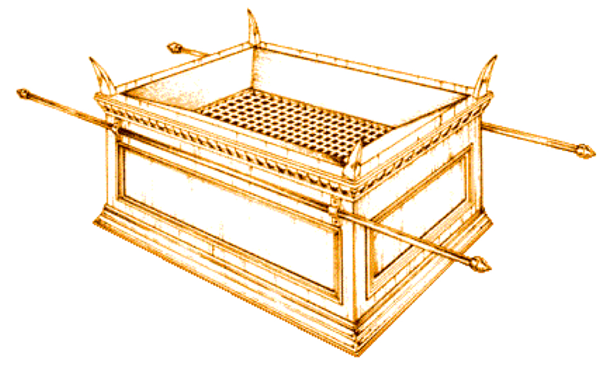

# Lesson #11 Altar of Burnt Offering, Exodus 27:1-8

## Introduction (REVIEW)

The Brazen Altar was the foundation of the whole worship of Israel. There was no approach to God and no worship accepted by by way of the Altar of the blood Atonement. It is a remarkable type of Jesus Christ in His person and His sacrificial work.

## Names Given to the Altar (REVIEW)

1. Altar of Shittim Wood, Exodus 27:1
2. The Brazen/Bronze Altar, Exodus 38:30
3. "The Altar" by way of pre-eminance, Exodus 29:12
4. Altar of Burnt Offering, Exodus 35:16
5. The Altar that is by the Door of the Tabernacle, Leviticus 1:5
6. My Altar, The Table of the Lord, Malachi 1:7; Lev. 21:6,22
7. Altar of the Lord, Malachi 2:13

## Materials Used in the Construction of the Altar (REVIEW)

1. Shittim Wood (This is a type of the flesh and humanity. It was necessary that Christ be made flesh.)
2. Brass/Bronze (Judgment of God and the Endurance of Christ to Withstand the heat.)

## Dimensions of the Altar

> Exodus 27:1 &mdash; And thou shalt make an altar of shittim wood, five cubits long, and five cubits broad; the altar shall be foursquare: and the height thereof shall be three cubits.

The Altar of Burnt Offering was seven and a half feet in length and breadth and four and a half feet in height. It was twice the length and height of the Ark of the Covenant. 

In fact, **it had capacity enough to contain all the other vessels of the sanctuary**. This is rich in meaning: within one great sacrifice on the cross every blessing is comprehended.

> Romans 8:32 &mdash; He that spared not his own Son, but delivered him up for us all, how shall he not with him also **freely give us all things**? 
What does the Believer Have or have access to through Christ being offered up?

- Peace with God (Romans 5:1)
- Joy in God, Atonement (Romans 5:11)
- Grace Reigns (Romans 5:21)
- The Renewing of the Holy Ghost (Titus 3:5,6)
- Predestinated Us Unto the Adoption of Children (Ephesians 1:5)
- The Victory (1 Corinthians 15:57; Romans 8:37; Hebrews 2:14)

## Horns of the Altar

- Might

In Exodus 27:2, the horns of the altar are mentioned which are symbol of prevailing might and strength. 

- The Gospels Influence

These horns pointed in every direction, signifying and presenting salvation to the four corners of the earth (north, south, east, west).

> Mark 16:15 &mdash; And he said unto them, Go ye into all the world, and preach the gospel to every creature.

- For Binding the Sacrifice

Sacrifices were bound to the altar before slain, but it was not nails but love that held Christ on the cross!

> Psalm 118:27 &mdash; God is the LORD, which hath shewed us light: bind the sacrifice with cords, even unto the horns of the altar

> John 10:18 &mdash; No man taketh it from me, but I lay it down of myself. I have power to lay it down, and I have power to take it again. This commandment have I received of my Father.

- Refuge for the Sincere

> 1 Kings 1:50 &mdash; And Adonijah feared because of Solomon, and arose, and went, and caught hold on the horns of the altar. 

<!-------->

> Solomon was to be the king after David, but his elder brother, Adonijah, was preferred by Joab, the captain of the host, and by Abiathar, the priest; and, therefore, they got together, and tried to set up Adonijah as king. They utterly failed in this; and when Solomn came to the throne Adonijah was afraid for his life, and fled to the horns of the altar at the tabernacle for shelter. Solomon permitted him to find sanctuary there, and forgave him his offence, and said that if he proved himself a worthy man he should live without further trouble.

<!-- -->

Typical of the poor sinner, who flees for refuge to lay hold of the Gospel. 

Also we find a solemn lesson in Exodus 21:14.

> Exodus 21:14 &mdash; But if a man come presumptuously upon his neighbor, to slay him with guile; thou shalt take him from mine altar, that he may die.

For the presumptous sinner and hyprocrite, the atonement of Jesus provides no shelter while he so continues.

> 1 Kings 2:28 &mdash; Then tidings came to Joab: for Joab had turned after Adonijah, though he turned not after Absalom. And Joab fled unto the tabernacle of the LORD, and caught hold on the horns of the altar.
<!-- -->

But very soon after Solomon's mercy to Adonijah, Adonijah and his confederates began plotting again, and sought to undermine Solomon now that David was dead. Solomon determined to begin dealing with Joab-the bottom of all the mischief, who, though he had not followed after Absalom in David's time, was now following after Adonijah. No sooner had the king determined upon this, than Joab thought that, as Adonijah had gotten a hold of the horns of the altar successfully before, Joab might repeat it, and have some hope for his life. 

He was a man of hoary head, who had thirty or more years before committed two atrocious murders, and now they came home to him. He did not know where to fly except he fled to the horns of an altar, which he had very seldom approached before. As far as we can judge, he had shown little respect to religion during his lifetime. He was a rough man of war, and cared little enough about God, or the tabernacle, or the priests, or the altar; but when he was in danger, he fled to that which he had avoided

> Charles Spurgeon "Joab sought to make a refuge of that which he had neglected. Now, I want you to notice that when Joab fled to the tabernacle of the Lord, and took hold of the horns of the altar, it was of no use to him."

<!-- -->

> 1 Kings 2:34 &mdash; So Benaiah the son of Jehoiada went up, and fell upon him, and slew him: and he was buried in his own house in the wilderness.

> Charles Spurgeon "Outward ordinances will avail nothing.... But, secondly, there is an altar-a spiritual altar-whereof if a man do but lay hold upon the horns, and say, "Nay; but I will die here," he shall never die; but he shall be safe against the sword of justice for ever; for the Lord has appointed an altar in the person of his own dear Son, Jesus Christ, where there shall be shelter for the very vilest of sinners if they do but come and lay hold thereon.