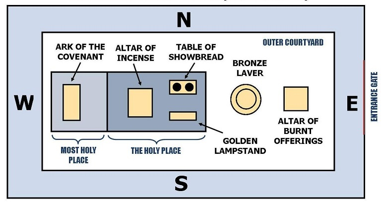

### General Description of the Outer Court

<!-- include:000_introduction-to-the-study-of-the-tabernacle.md -->

The Tabernacle was surrounded by a court which was double square one hundred and fifty feet in length and seventy five in width. The court was formed by brass pillars standing upright in sockets of brass. There were 20 on the south, 20 on the north, and ten each of the eastern and western sides. These were connected with hoods and fillets of silver. From these hung curtains of fine twined linen which went all around the court forming a wall. The curtains were seven and a half feet high.

The materials forming the court were:

1. **Fine Twined Linen** (type of Divine righteousness)

Compare Revelation 19:7,8 and Philippians 3:9. There was no way of access through this hanging. There were no holes or ill-adjusted corners through which one might slip. There is only one way of approach and that is through the gate.

2. **Brass** (type of Divine judgment)

Numbers 21:6-9; Revelation 1:15

3. **Silver** (type of Divine Redemption)

Exodus 30:11-16. Note carefully the assocation of the fine twined linen brass and silver. It was through Divine judgment upon the spotless "Sin Offering" that redemption was completed and through redemption that we were made righteous. In Christ, we have our place of redemption with Him in fine twined linen. 2 Corinthians 5:21